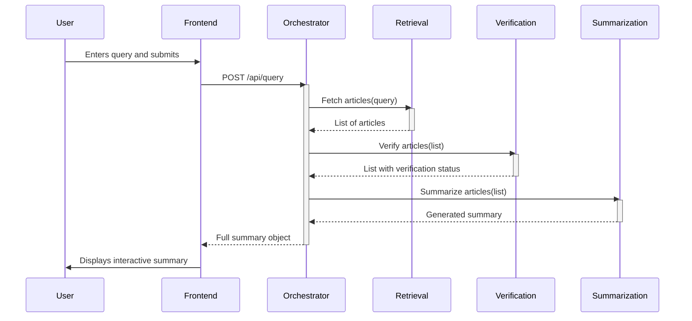

# TruthLens Fullstack Architecture Document

## Introduction

This document outlines the complete fullstack architecture for TruthLens, including backend systems, frontend implementation, and their integration. It serves as the single source of truth for AI-driven development, ensuring consistency across the entire technology stack. This unified approach combines what would traditionally be separate backend and frontend architecture documents, streamlining the development process for modern fullstack applications.

#### Starter Template or Existing Project
*   We will use the **Vercel Next.js Enterprise Boilerplate** as the foundation for this project. It provides a pre-configured monorepo with CI/CD, TypeScript, and best practices aligned with our Vercel deployment target. We will then add our FastAPI backend as a new application within this monorepo structure.
*   **Mitigation:** A new story, "Adopt & Clean Starter Template," will be added to Epic 1 to ensure the team familiarizes themselves with the template, updates dependencies, removes unused code, and creates a proof-of-concept for Python integration.

#### Change Log
| Date       | Version | Description                       | Author            |
| :--------- | :------ | :-------------------------------- | :---------------- |
| 2025-09-06 | 1.0     | Initial draft of Architecture Doc | Winston, Architect |

---

## High Level Architecture

### Technical Summary
The architecture for TruthLens is a modern, full-stack serverless solution designed for rapid development and scalability. The frontend will be a mobile-first React/Next.js application, deployed on Vercel's edge network. The backend consists of a suite of independent, agent-based serverless functions, written in Python with FastAPI, also hosted on Vercel. Data will be stored in a MongoDB Atlas NoSQL database. This architecture directly supports our agile, epic-driven approach, allowing for modular development and deployment while leveraging the generous free tiers of our chosen platforms.

### Platform and Infrastructure Choice
*   **Platform:** Vercel and MongoDB Atlas.
*   **Key Services:**
    *   **Vercel:** Frontend Hosting, Serverless Functions (for backend agents), CI/CD.
    *   **MongoDB Atlas:** NoSQL Document Database.
    *   **Supabase:** Retained as an option for Authentication and File Storage if needed in the future.
*   **Deployment Host and Regions:** Vercel Edge Network (Global), MongoDB Atlas (Default Region, e.g., US East).
*   **Trade-offs:** We are consciously accepting a degree of platform lock-in with Vercel and MongoDB Atlas in exchange for a significant increase in development speed and a reduction in operational complexity for the MVP.

### Repository Structure
*   **Structure:** Monorepo.
*   **Monorepo Tool:** We will use the structure provided by the **Vercel Next.js Enterprise Boilerplate**, which is powered by Turborepo.
*   **Package Organization:** The monorepo will contain an `apps/` directory for the deployable applications (e.g., `web` for the frontend, `api` for the backend functions) and a `packages/` directory for shared code (e.g., `shared-types`, `ui-components`).

### High Level Architecture Diagram
```mermaid
graph TD
    subgraph User
        U[Skeptical Verifier]
    end

    subgraph Vercel Platform
        subgraph Frontend
            WebApp[React/Next.js App]
        end
        subgraph Backend (Serverless Functions)
            Orchestrator[Orchestrator Agent]
            Retrieval[Retrieval Agent]
            Verification[Verification Agent]
            Summarization[Summarization Agent]
        end
    end

    subgraph Cloud Services
        DB[(MongoDB Atlas)]
    end

    subgraph External Services
        NewsAPIs[News APIs]
        Blockchain[Blockchain Node]
        LLM[LLM API]
    end

    U --> WebApp;
    WebApp --> Orchestrator;
    Orchestrator --> Retrieval;
    Orchestrator --> Verification;
    Orchestrator --> Summarization;
    Retrieval --> NewsAPIs;
    Verification --> Blockchain;
    Summarization --> LLM;
    Orchestrator --> DB;
```

### Architectural Patterns
*   **Serverless Architecture:** The backend will be composed of independent, stateless functions that execute on demand. _Rationale:_ This is cost-effective, highly scalable, and aligns perfectly with our "free tier" constraint.
*   **Monorepo:** All code for the frontend, backend, and shared packages will reside in a single repository. _Rationale:_ Simplifies dependency management and cross-cutting changes for a small team.
*   **Agent-Based Modules:** Each core backend capability will be a logically separate agent (a serverless function). _Rationale:_ This enforces separation of concerns and allows for independent development and testing.
*   **Mobile-First Design:** The user interface will be designed for a mobile experience first, then adapted for desktop. _Rationale:_ This prioritizes the platform where our target users are most active.

---

## Tech Stack

| Category             | Technology                  | Version | Purpose                                | Rationale                                      |
| -------------------- | --------------------------- | ------- | -------------------------------------- | ---------------------------------------------- |
| Frontend Language    | TypeScript                  | 5.x     | Type safety for UI                     | Industry standard, improves code quality.      |
| Frontend Framework   | Next.js (React)             | 14.x    | UI framework and rendering             | Vercel's native framework, excellent performance. |
| UI Component Library | shadcn/ui                   | latest  | Building UI components                 | As specified in PRD.                           |
| CSS Framework        | Tailwind CSS                | 3.x     | Styling                                | As specified in PRD.                           |
| Backend Language     | Python                      | 3.11    | Serverless function logic              | As specified in PRD, good for AI/ML.           |
| Backend Framework    | FastAPI                     | latest  | Creating API endpoints                 | High performance async framework.              |
| API Style            | REST                        | n/a     | Communication between FE/BE            | Simple, well-understood, good for serverless.  |
| Database             | MongoDB                     | 7.x     | Primary data storage                   | Document model fits our data structure well.   |
| CI/CD                | GitHub Actions              | v4      | Continuous integration and deployment  | Included with Vercel boilerplate.              |
| Build Tool           | Turborepo                   | 1.x     | Managing the monorepo                  | Included with Vercel boilerplate.              |
| Frontend Testing     | Vitest / React Testing Lib  | latest  | Unit and component testing             | Modern, fast, and standard for React.          |
| Backend Testing      | Pytest                      | latest  | Unit and integration testing           | Standard and powerful for Python.              |
| E2E Testing          | Playwright                  | latest  | End-to-end browser testing             | Robust, modern, and good for interactive sites.|

---

## Data Models

### User
*   **Purpose:** Represents a user of the application. (Future-proofing for auth).
*   **TypeScript Interface:**
    ```typescript
    interface User {
      id: string; // a.k.a. sub from JWT
      email: string;
      createdAt: Date;
    }
    ```

### Query
*   **Purpose:** Represents a query made by a user and the resulting summary.
*   **TypeScript Interface:**
    ```typescript
    interface Query {
      id: string;
      userId?: string;
      queryText: string;
      summary: Summary;
      createdAt: Date;
    }
    ```

### Summary
*   **Purpose:** The structured summary output from the agents.
*   **TypeScript Interface:**
    ```typescript
    interface Summary {
      format: 'debate' | 'venn_diagram';
      content: any; // Flexible structure for different formats
      sources: Source[];
    }
    ```

### Source
*   **Purpose:** Represents a source article used in a summary.
*   **TypeScript Interface:**
    ```typescript
    interface Source {
      url: string;
      title: string;
      isVerified: boolean; // From blockchain check
      biasScore?: number; // Future use
    }
    ```

---
## Core Workflows

### Main Query Sequence Diagram


---

## Testing Strategy
A formal **Test Strategy Document** will be created as a prerequisite to Epic 1 development. It will detail the approach to testing non-deterministic AI outputs, performance testing the 30-second NFR, and the specific tools and processes for unit, integration, and E2E testing.

---
## Unified Project Structure
```
truthlens/
├── apps/
│   ├── web/          # Next.js frontend application
│   └── api/          # Python/FastAPI backend agents (serverless functions)
├── packages/
│   ├── shared-types/ # Shared TypeScript interfaces between FE and BE
│   └── ui/           # Shared React components
├── docs/
│   ├── prd.md
│   └── architecture.md
└── package.json      # Root package.json for monorepo
```

---
*(Additional sections like API Specification, Detailed Component Breakdown, Security, etc., will be filled in as part of the ongoing design process during each epic.)*
