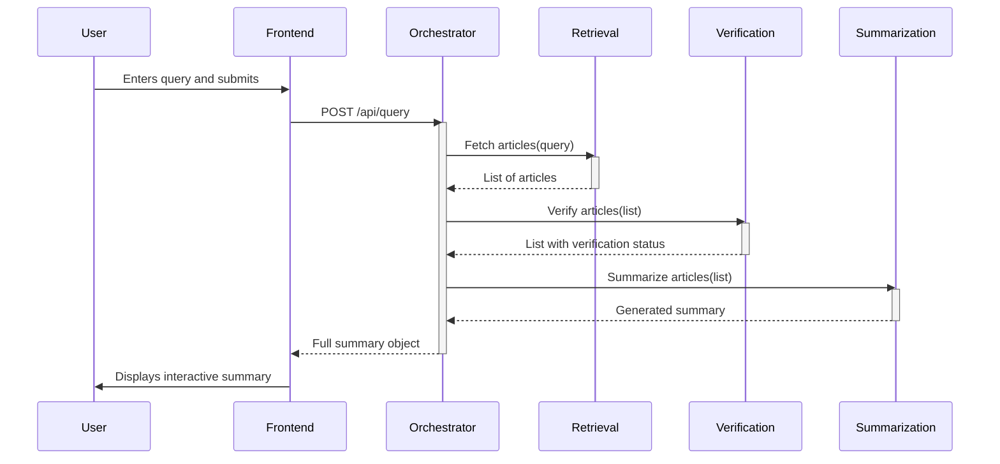

# Core Workflows

## Main Query Sequence Diagram

```mermaid
sequenceDiagram
    participant User
    participant Frontend
    participant Orchestrator
    participant Retrieval
    participant Verification
    participant Summarization

    User->>Frontend: Enters query and submits
    Frontend->>Orchestrator: POST /api/query
    activate Orchestrator
    Orchestrator->>Retrieval: Fetch articles(query)
    activate Retrieval
    Retrieval-->>Orchestrator: List of articles
    deactivate Retrieval
    Orchestrator->>Verification: Verify articles(list)
    activate Verification
    Verification-->>Orchestrator: List with verification status
    deactivate Verification
    Orchestrator->>Summarization: Summarize articles(list)
    activate Summarization
    Summarization-->>Orchestrator: Generated summary
    deactivate Summarization
    Orchestrator-->>Frontend: Full summary object
    deactivate Orchestrator
    Frontend->>User: Displays interactive summary
```

---
